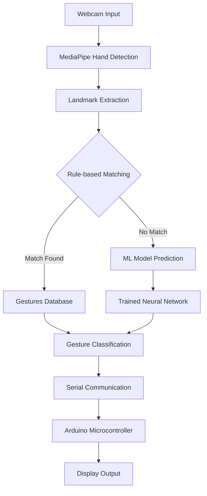

# Hand Sign IoT Project - Comprehensive Overview

## Project Description
This project is an IoT-based hand sign recognition system that combines computer vision, machine learning, and microcontroller technologies to detect and interpret hand gestures in real-time. The system uses a hybrid approach that combines rule-based gesture recognition with a trained machine learning model for improved accuracy.

## System Architecture



## Technology Stack

### Software Components

| Component | Technology | Purpose |
|----------|------------|---------|
| Core Language | Python 3.x | Primary programming language |
| Computer Vision | MediaPipe | Hand landmark detection |
| Machine Learning Framework | TensorFlow/Keras | Neural network model |
| Data Processing | NumPy, Pandas, scikit-learn | Data manipulation and preprocessing |
| Serial Communication | PySerial | Communication with Arduino |
| Image Processing | OpenCV | Video capture and image processing |

### Hardware Components

| Component | Specifications | Purpose |
|----------|------------|---------|
| Camera | Standard Webcam | Capturing hand gestures |
| Microcontroller | Arduino | Processing gesture data and controlling display |
| Display | I2C-connected Display (assumed) | Showing recognized gestures |

## Machine Learning Model

### Model Architecture
The neural network consists of dense layers with dropout for regularization:

1. **Input Layer**: Accepts flattened hand landmark coordinates (63 features: 21 landmarks × 3 coordinates each)
2. **Hidden Layer 1**: 128 neurons with ReLU activation, 0.3 dropout rate
3. **Hidden Layer 2**: 64 neurons with ReLU activation, 0.2 dropout rate
4. **Output Layer**: Number of neurons equals number of gesture classes with Softmax activation

### Training Process
- **Dataset**: CSV file containing hand landmark coordinates and corresponding labels
- **Preprocessing**: Label encoding and conversion to categorical format
- **Split**: 80% training, 20% testing
- **Optimization**: Adam optimizer with categorical crossentropy loss
- **Regularization**: Early stopping with patience of 10 epochs

### Model Performance
- Saved as HDF5 format ([hand_sign_model.h5](file:///c%3A/dammmmn%20son/projects/micro%20controllers/hand_sign_iot_project/model/hand_sign_model.h5))
- Label classes stored separately ([label_classes.npy](file:///c%3A/dammmmn%20son/projects/micro%20controllers/hand_sign_iot_project/model/label_classes.npy))

## Rule-Based Gesture Recognition

Implements predefined rules for common gestures based on finger states:
- Hello: All fingers extended
- Thanks/Yes: All fingers closed
- No/Come/Go: Index and middle fingers extended
- Sorry: Thumb, index, and pinky extended
- Stop: All fingers except thumb extended
- Wait: Index, middle, ring fingers extended
- Bye Bye: Index and middle fingers of both hands extended
- Eat: Only index finger extended
- Drink: Only thumb extended
- Okay: Specific combination of finger positions

## System Workflow

1. **Data Collection & Training**:
   - Landmark data collected and stored in CSV format
   - Model trained using [train_model.py](file:///c%3A/dammmmn%20son/projects/micro%20controllers/hand_sign_iot_project/scripts/train_model.py)
   - Trained model saved for inference

2. **Real-Time Recognition** ([rule_based_version.py](file:///c%3A/dammmmn%20son/projects/micro%20controllers/hand_sign_iot_project/scripts/rule_based_version.py)):
   - Webcam captures video stream
   - MediaPipe detects hand landmarks
   - First attempts rule-based matching
   - Falls back to ML model prediction if no rule matches
   - Sends recognized gesture to Arduino via serial communication

3. **IoT Integration**:
   - Arduino receives gesture data via serial
   - Processes and displays gesture on connected display

## File Structure

```
hand_sign_iot_project/
├── arduino/
│   └── display_sign/
│       └── display_sign.ino (I2C scanner utility)
├── model/
│   ├── hand_sign_model.h5 (Trained ML model)
│   └── label_classes.npy (Gesture label mappings)
├── scripts/
│   ├── prediction_log.txt (Log file)
│   ├── rule_based_version.py (Main recognition system)
│   └── train_model.py (Model training script)
└── venv/ (Virtual environment)
```

## Key Features

1. **Hybrid Recognition Approach**: Combines speed of rule-based recognition with accuracy of ML
2. **Real-time Processing**: Processes video feed in real-time with minimal latency
3. **Robust Communication**: Serial communication with Arduino for IoT integration
4. **Extensible Design**: Easy to add new gestures to either rule base or training dataset
5. **Error Handling**: Graceful handling of camera and communication failures

## Potential Improvements

1. Implement actual gesture display functionality in Arduino code
2. Add more sophisticated gesture recognition rules
3. Improve model training with data augmentation
4. Add gesture history and statistics tracking
5. Implement gesture confidence visualization